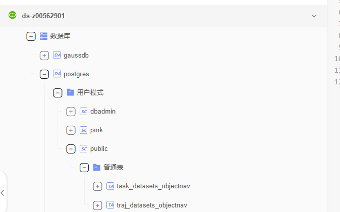

# 登录DWS
* 使用CTO账号登录huaweicloud.com
* 切换DWS：https://console.huaweicloud.com/dws/#/dws/management/instanceInfo/4724ff6e-6ee9-42d6-a8ad-3b27abd1f898/basicInfo?version=9.1.0.222

# 任务导入DWS
参照task2dws

# 为轨迹生成metric
参照gen traj metric

# 轨迹导入DWS
参照traj2dws

# 轨迹报表
* dlv：https://console.huaweicloud.com/dlv/vision/design/?projectId=05ebbfab5a0026ff2fffc01700fe334f&screenId=ff80808296ca13200199c6f216c31059&name=traj_datasets_objectnav&locale=zh-cn&region=cn-east-3&workspaceId=7227c91fe5ed4f69afba39f6cab48cfe#scene_type=hm3d_v1&split=train&gen_traj_method=hd

# 待办
* 报表：从dlv切换到dataarts insight
* 轨迹回放：如果文件已经存在，可选择是否跳过
    * 后续优化
* 轨迹生产：云道
    * 优先级高
* 模型评测：添加traj_replay节点，完成轨迹回放
* 轨迹回放：单个容器需要4Gib显存，但是占用1个GPU
    * 已经优化；减少3/4耗时
* 轨迹回放: 支持重建场景-外网
    * 告诉欧阳zile
* 批量入库：导入轨迹时，如果相应的任务没有导入，提示报错
* 入库优化：文件和数据库可能存在不一致的情况，后续是否可以尝试hive
* 文件大小：保存文件过大